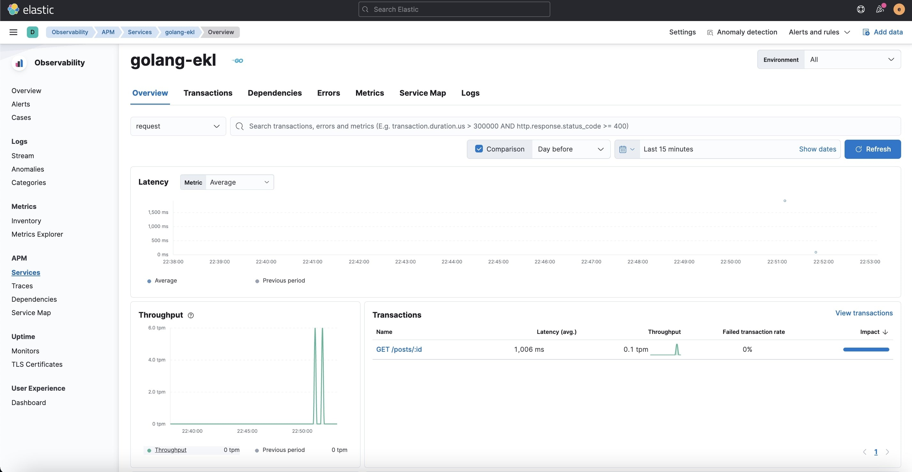
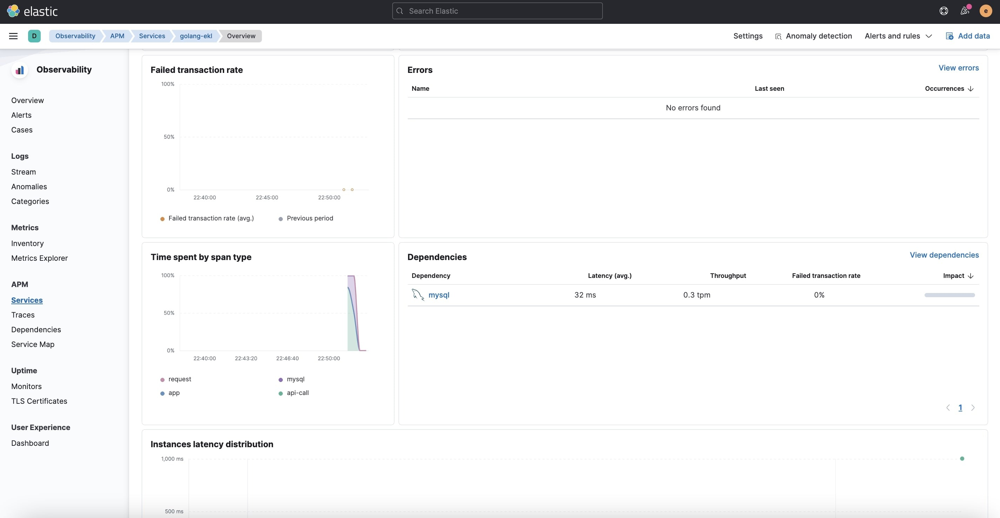
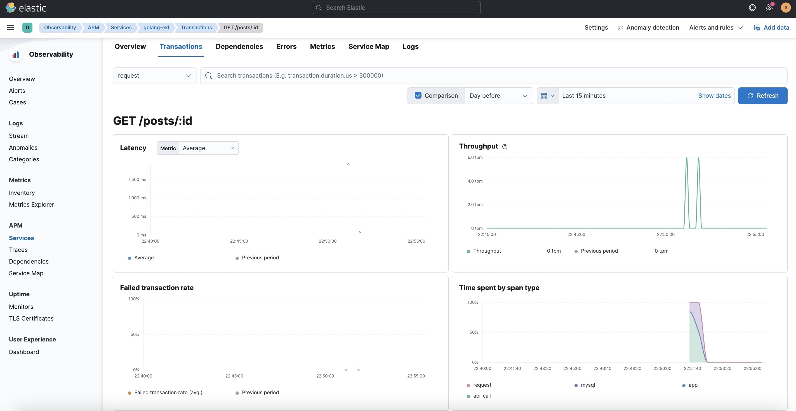
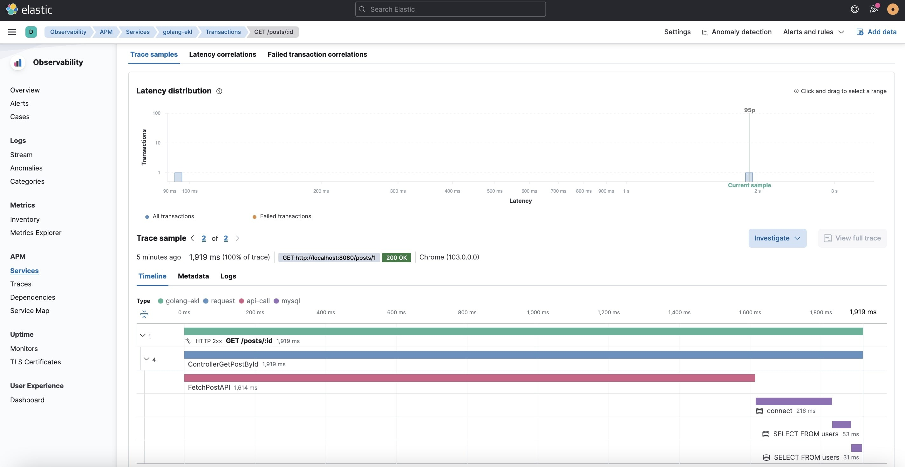
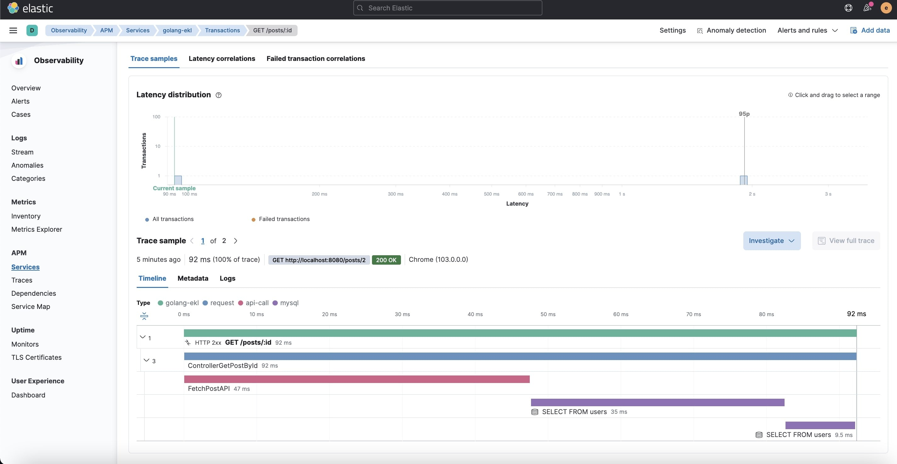
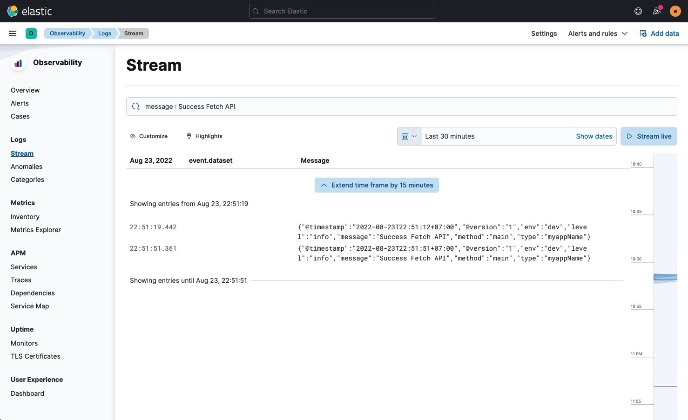

# ELK Stack for Observability and Logging

### Tools
- ELK
- APM
- Logrus

### Manual Installation 
1. Setup ELK ```docker-compose up -d```

2. Setup Kibana go to ```http://localhost:5601```

3. Go to menu Integrations setup Elastic APM and Logstash

4. Add Index patterns for ```logstash-*``` on menu ```http://localhost:5601/app/management/kibana/indexPatterns/```

5. Sample use APM and Logrus on Project Golang
    - Setup Database Mysql ```docker-compose -f dcoker-compose-mysql.yaml up -d```
    - Create table and record on mysql
        ```sh
        CREATE TABLE users (
            id INT(6) UNSIGNED AUTO_INCREMENT PRIMARY KEY,
            name VARCHAR(30) NOT NULL,
            email VARCHAR(50)
        );

        INSERT INTO users (name, email) VALUES ("Aji Indra Jaya", "aji@mail.local");
        ```
    - Setup Golang
        ```sh
        # 1. Install Golang
        https://go.dev/doc/install

        # 2. Init module
        go mod tidy

        # 3. Export Environment
        export ELASTIC_APM_SERVICE_NAME="golang-api"
    	export ELASTIC_APM_ENVIRONMENT="dev"
        ```
    - Run Application ```go run main.go``` hit Url ```http://localhost:8080/posts/1``` and ```http://localhost:8080/posts/2```

6. Result Observability go to menu APM Services or hit url ```http://localhost:5601/app/apm/services```
    - Services
        

    - Profile Service golang-elk 
        
        

    - Profile Service Transactions
        

    - Profile Service Transactions
        

    - Profile Service Transactions Url ```http://localhost:8080/posts/1```
        

    - Profile Service Transactions Url ```http://localhost:8080/posts/2```
        

7. Result Logging Logs Stream or hit Url ```http://localhost:5601/app/apm/services```
    


### Contact
https://www.linkedin.com/in/aji-indra-jaya

License
----

MIT